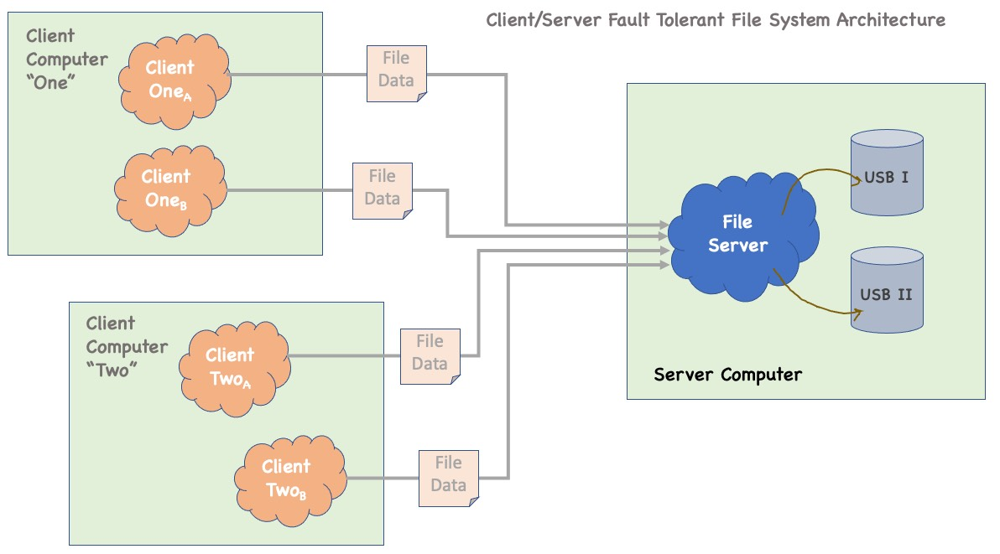
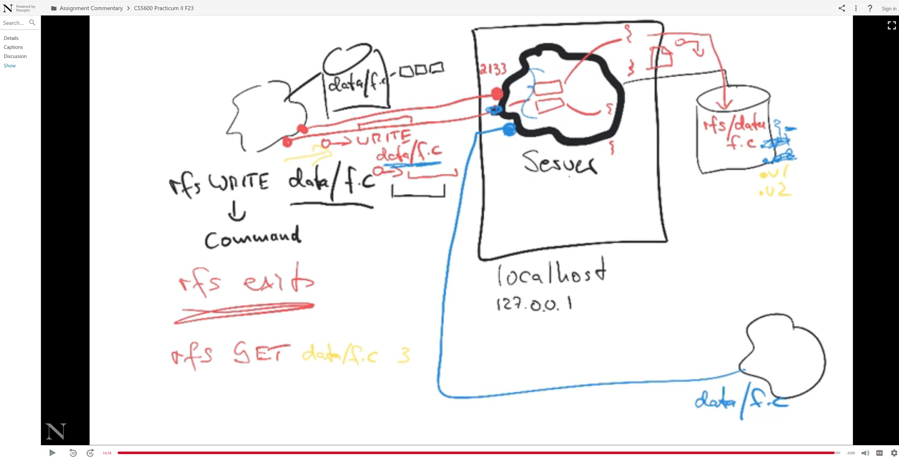

# [15 hrs] DO: Practicum II (Fall 2025)
**Due** Dec 4 by 11:59pm  
**Format:** Individual; working in groups, pairs, or collaborating on anything other than design is not allowed. You may not share code, but you may ask others questions or form informal groups to discuss design. You may use AI Assistants to write or debug your code, but you must know how it works and not being able to thoroughly explain your code's inner working during the review will result in a reduced grade for the review and the practicum. You are required to indicate in your code if portions were generated by an AI Assistant, such as GitHub Co-Pilot, ChatGPT, Gemini, or any others. Of course, you must be able to explain any code you generate with an LLM or copy from a web resource.

**Estimated Time:** 15-20 hours

**Due Date:** See Canvas

**Late Submissions:** accepted until Saturday December 8 (last day of graduate classes) at 11:59pm ET

**Required Programming Language:** all code, except shell scripts, must be completed in C and must run on Linux

This Practicum includes "bonus points", so the total number of points achievable is greater than 100. Questions 1 through 5 are the regular questions adding up 90 plus 10 points for code elegance, testing, documentation, and code quality making the total 100.

# Motivation
Most programs require persistent storage of data either in a file or in a database. Most operating systems provides a file system to allow writing and reading of bytes from a storage device. However, those files are written to a local storage device so sharing and versioning are difficult. So, some programs use a remote file system with versioning.

In this practicum you will implement a server-based versioning file storage system that allows any program to open a TCP connection through a socket (a kind of file in Unix), request file services from a server (reading a file, writing to a file, creating a folder, get information about a file or folder, and deleting a file or folder).

Below is a sketch of a system architecture for a multi-threaded client/server file system.

The video below provides some commentary that you might find useful to set context.

# Prerequisite Work
Before you start the practicum you will need to learn to how send and receive streams of bytes via a TCP socket.

[93.202 -- Inter-Process Communication with TCP Sockets in C](http://artificium.us/lessons/93.networks/l-93-202-tcp-sockets-c/l-93-202.html)

You may wish to locate additional resources on the web to help you learn how to work with sockets in C or use your favorite AI Assistant. 

# Preliminary Task
Follow the tutorial from the prerequisite lesson [93.202 -- Inter-Process Communication with TCP Sockets in C](http://artificium.us/lessons/93.networks/l-93-202-tcp-sockets-c/l-93-202.html) above and download the server and client code "as is" and get it to run and communicate. After this you will have a working shell for a client and a server.

# Question 1 (20 Points)
Using the code from the above tutorial, expand the code to allow you to send a command from a client to the server for writing a file from the client's file system to the server. The request needs include some kind of command (e.g., WRITE) and a path to a local file name (e.g., folder/foo.txt) and the path and name of the file on the server. The design of the command protocol is up to you.

Your client program must allow command line arguments to write the file, e.g., 

`% rfs WRITE data/localfoo.txt folder/foo.txt` 
This program should connect to the server, send the "WRITE" command and the file data, and then save that data in a file under the name of the second argument in the correct folder under some "root" folder on the server. So, the use of rfs is:

`% rfs WRITE local-file-path remote-file-path` 
You need to figure out how to get data from the client to the server. Assume that the client and server run on different systems. That means that you cannot use the file system to send the file as the client and server would be running on different computer systems in practice. 

If the remote file or path is omitted, use the values for the first argument.

Be sure to create tests that have the client and server on different physical (or virtual) machines. You may use physical computers, local virtual machines, or virtual machines in the cloud.

The server keeps running continuously until its process is killed. The rfs client connects, does its (one) command, closes the socket, and exits, but the server keeps running.

# Question 2 (20 Points)
Continuing with the code, implement a command that retrieves a new file from the remote file system, e.g., GET folder/path/file.txt, and writes the data read from the socket to a local file. If the local file path or name (the third command line argument) is omitted, use current folder.

`% rfs GET remote_folder/remote_file.html local_folder/local_file.html`
# Question 3 (10 Points)
Continuing with the code, implement a command that deletes a file or folder in the remote file system, e.g., RM folder/path/file.txt, and returns some code or indication about its success status.

`% rfs RM folder/somefile.txt`
# Question 4 (25 Points)
Continue expanding your code and now create a new thread or process for every client so you can service multiple clients simultaneously. Be sure to carefully consider your critical regions and ensure that shared data structures are not corrupted. Consider of multiple clients write to the same file at the same time -- how do you ensure integrity of the file?

# Question 5 (15 Points)
Modify the code so that when a WRITE request writes to the same remote file name more than once, that the prior version is not simply overwritten but saved as an older version, i.e., implement a versioning file system.

# Question 6 (20 Bonus Points)
Add a command that gets all versioning information about a file, i.e., the name of the file and all timestamps when the versions were last written to.

`% rfs LS folder/somefile.txt`
# Question 7 (10 Bonus Points)
Modify the code so that a GET allows you to request a specific version of a file.

 

An additional 10 points are awarded for testing, code elegance, code structure, commenting, and general professional development practices.

# Simplifying Assumptions, Hints, and Tips
You must check for out of storage situations and return appropriate error messages.
You do not need to be concerned about fragmentation.
Check Teams frequently for questions, answers, and clarifications.
When you stop a process with CTRL-C, it'll exit by default leaving ports open and potentially data unset. So, it is best to "catch" or "trap" the SIGINT signal and add your own behavior so you can do a "safe" exit... [https://www.delftstack.com/howto/c/sigint-in-c/](https://www.delftstack.com/howto/c/sigint-in-c/)

# Intended Workflow
start the server program, i.e., rfserver &
server waits on a port (whatever you set it, let's say 7768) for clients to connect
you do: rfs LS foo/bar.c
in the multi-threaded version, a thread is spawned to handle the client's request
rfs (the client) connects to the server on port 7768 and send it the string LS foo/bar.c
server reads from the socket and gets the string LS foo/bar.c
it interprets the command: LS and then calls some handling function, perhaps via a table of pointers to handler functions
in that function you get the info and versions for the file (where and how is up to you)
server returns the information to the client by writing to the socket; format in whatever way you like
client gets the information, parses it, and then printf's it to the console
clients (get) disconnect/closes the socket
server waits for next client
You turn off the server by killing the process... or you could have another command that stops the server, e.g., fget STOP -- if the server gets that command it calls exit(0) to exit the process after closing the socket.

 

# Submission
Submit a .tar file containing all of your code, notes, and test cases. Schedule time for your review.

The total of achievable points is 130 out of 100, i.e., 30 "bonus points" that can offset your Practicum I grade or boost your overall grade. It is challenging to earn all possible points. In fact, we do not expect you to earn all of the points, but we give you an opportunity to do so.